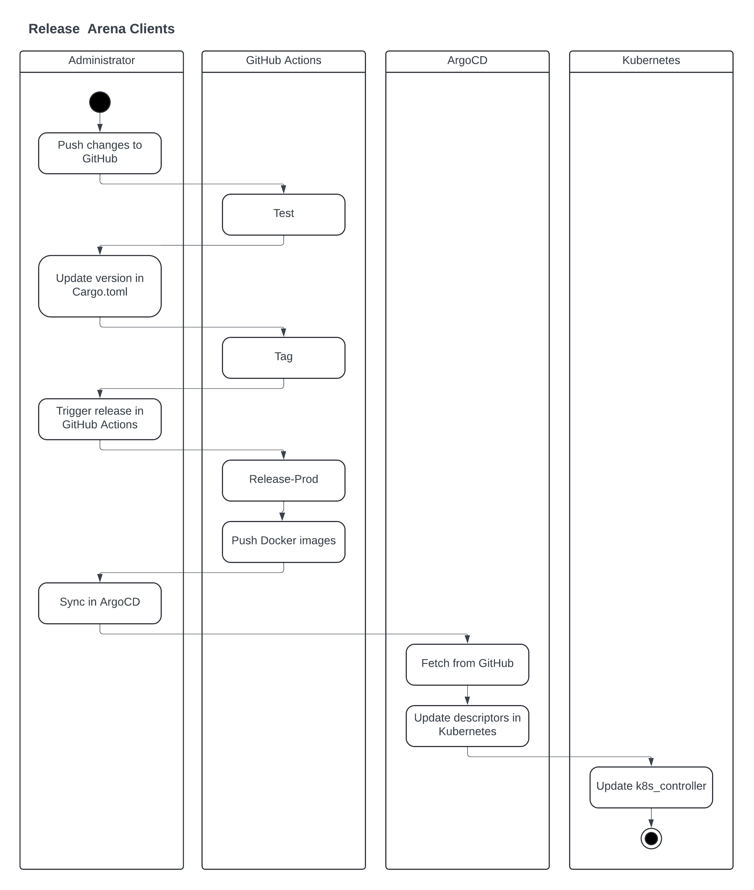

The three major components of AI Arena - Frontend, Clients, Stream - are released with different procedures.

# Frontend

The frontend includes the website and the API are released from [github.com/aiarena/aiarena-web](https://github.com/aiarena/aiarena-web) using AWS CloudFormation.

# Clients

The clients are released from [github.com/aiarena/sc2-ai-match-controller](https://github.com/aiarena/sc2-ai-match-controller) using GitHub Actions and ArgoCD.

* Changes pushed to the GitHub repo automatically start GitHub Action "Test".
* When the changes are ready for release, file Cargo.toml must be updated with the new version number and GitHub Action "Tag" must be manually started.
* Next, manually start GitHub Action "Release-Prod" to create the Docker images and push them to DockerHub.
* Finally, manually sync ArgoCD application "k8s-controller" to fetch the Kubernetes descriptors and Kustomize configuration and update the Kubernetes deployment "k8s-controller".

Kubernetes deployment "k8s-controller" will start new arena client jobs with the new version.

Note: GitHub Action "Release" and ArgoCD application "k8s-controller-staging" release to staging deployment in the same Kubernetes cluster.

# Stream

The stream is updated manually.
