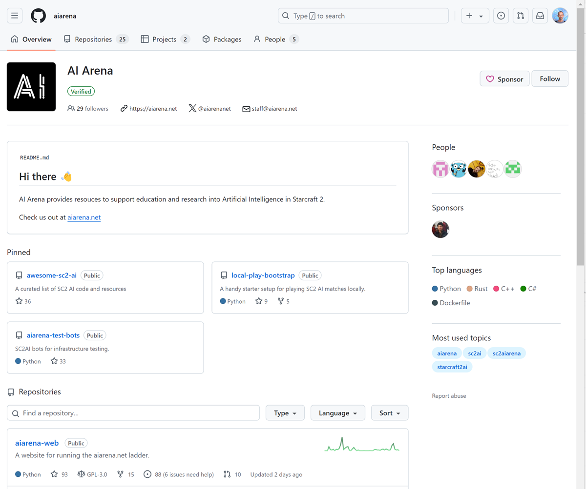
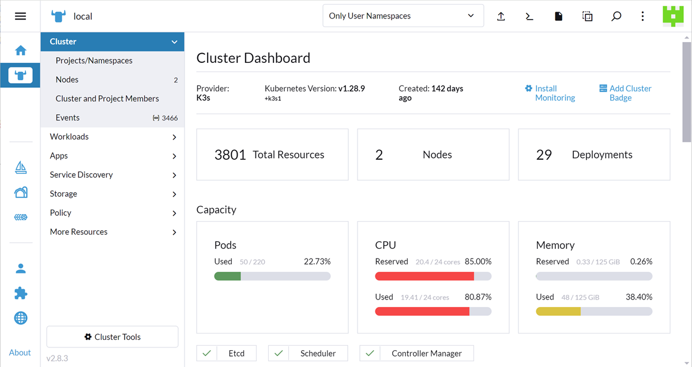

# Tools

This is a list of the tools used to support AI Arena.

## AgroCD

...

## Amazon CloudWatch

Monitoring dashboard.

## GitHub

Repository for all source code and configuration.

[https://github.com/aiarena](https://github.com/aiarena)

## Grafana

Monitoring dashboard.

[https://grafana.kube.aiarena.net](https://grafana.kube.aiarena.net) - NOT USED - Dashboard for the logs of AI Arena clients. Hosted in the Kubernetes cluster in namespace `grafana`.

## Rancher

Controls the Kubernetes cluster for AI Arena clients.

[https://rancher.kube.aiarena.net/dashboard](https://rancher.kube.aiarena.net/dashboard)

