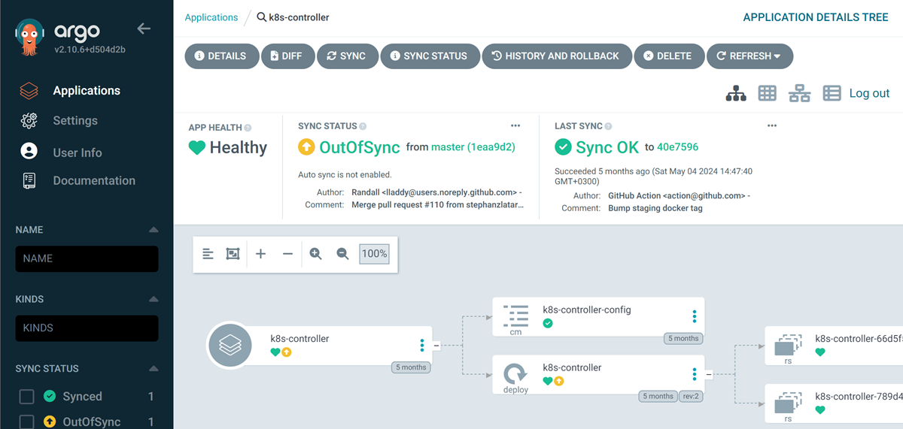
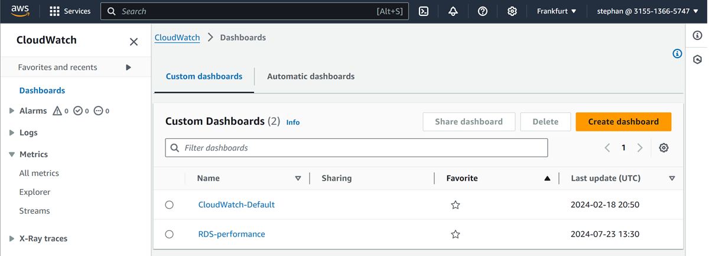

# Tools

This is a list of the tools used to support AI Arena.

## AgroCD

Continuous delivery for the Kubernetes cluster for AI Arena clients.

[https://argocd.kube.aiarena.net/applications/argocd/k8s-controller](https://argocd.kube.aiarena.net/applications/argocd/k8s-controller)

## Amazon CloudWatch

Monitoring dashboards for AI Arena frontend and database:
* CloudWatch-Default - AWS Fargate tasks metrics.
* RDS-performance - Amazon Relational Database Service (RDS) metrics.

[https://eu-central-1.console.aws.amazon.com/cloudwatch/home?region=eu-central-1#dashboards/](https://eu-central-1.console.aws.amazon.com/cloudwatch/home?region=eu-central-1#dashboards/)

## GitHub

Repository for all source code and configuration.

[https://github.com/aiarena](https://github.com/aiarena)

## Grafana

Monitoring dashboard for the Kubernetes cluster for AI Arena clients.

[https://grafana.kube.aiarena.net](https://grafana.kube.aiarena.net) - NOT USED - Dashboard for the logs of AI Arena clients. Hosted in the Kubernetes cluster in namespace `grafana`.

## Rancher

Controls the Kubernetes cluster for AI Arena clients.

[https://rancher.kube.aiarena.net/dashboard](https://rancher.kube.aiarena.net/dashboard)

